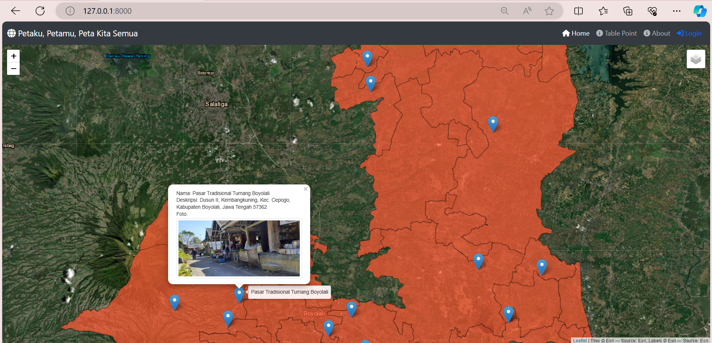
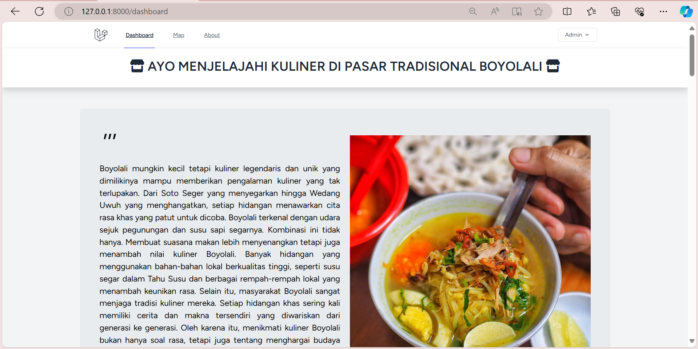
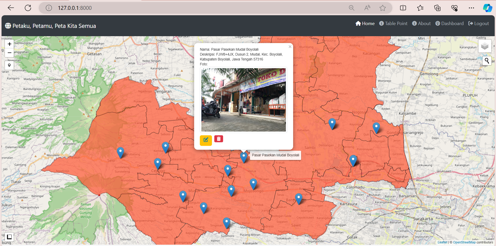
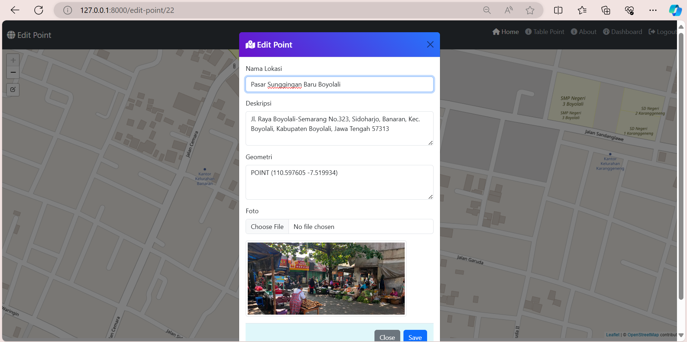
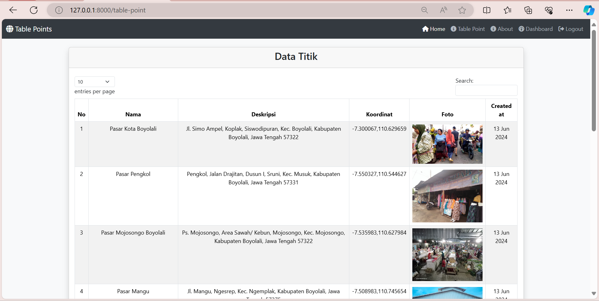
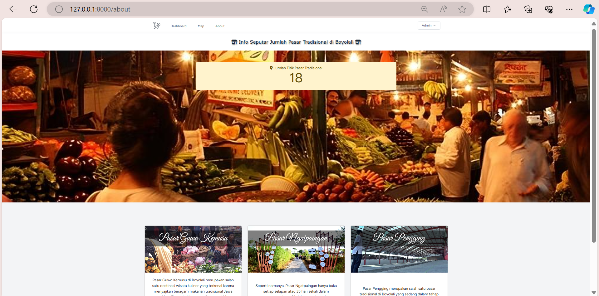

## Ragam Pasar & Kuliner Boyolali

Ragam Pasar dan Kuliner Boyolali adalah sebuah situs *webGIS* yang memberikan informasi lengkap mengenai berbagai pasar tradisional dan pilihan kuliner khas di Boyolali, Jawa Tengah. Situs ini menyajikan informasi tentang tempat-tempat kuliner terbaik, menu spesial, dan pengalaman unik yang bisa ditemukan di setiap pasar. Situs ini memiliki tujuan untuk mempromosikan kekayaan budaya dan cita rasa lokal, Ragam Pasar dan Kuliner Boyolali menjadi panduan penting bagi wisatawan dan pecinta kuliner yang ingin mengeksplorasi pesona di Boyolali.

*WebGIS* Ragam Pasar dan Kuliner Boyolali disusun dengan menerapkan beberapa komponen penting antara lain:
1. Menggunakan *platform Laravel* untuk penyusunan *webGIS* yang diintegrasikan dengan *GeoServer* untuk menampilkan data batas administrasi Kecamatan Boyolali dalam format *GeoJSON*.  *Laravel* merupakan *framework* PHP yang menjadi dasar aplikasi, menawarkan *routing, kontroler*, dan fitur lain untuk mengelola permintaan HTTP dan logika bisnis.
2. *WebGIS* ini disusun dengan bahasa pemrograman HTML, CSS, dan *JavaScript*.
3. Menggunakan *BootStrap* untuk mengatur tampilan *web* menjadi lebih menarik.
4. Menggunakan *database* seperti *MySQL/PostgreSQL* untuk menyimpan data titik persebaran pasar yang memuat nama lokasi, titik geometri, gambar, tanggal dibuat, dan foto lokasi.
5. Menggunakan API *Google Maps* untuk pencarian lokasi pada tampilan peta.

Sumber data:
1. *Google Maps* untuk persebaran titik pasar di Boyolali
2. Data *Shapefile* Batas Administrasi Kecamatan Boyolali
3. *Website*:
- Soto Seger Mbok Giyem (https://kumparan.com/harley-b-sastha/soto-seger-mbok-giyem-kuliner-legendaris-boyolali-yang-segernya-bikin-nagih-1uF0yCPrmr4)
- Tahu Susu (https://inibaru.id/kulinary/tahu-susu-olahan-unik-dari-susu-khas-boyolali)

Tangkapan Layar Komponen Penting

1. Tampilan Awal
    
2. *Dashbord*
    
3. *Map*
    
    - *Edit Point & Update Point*
        
4. *Table-point*
    
5. *About*
    
